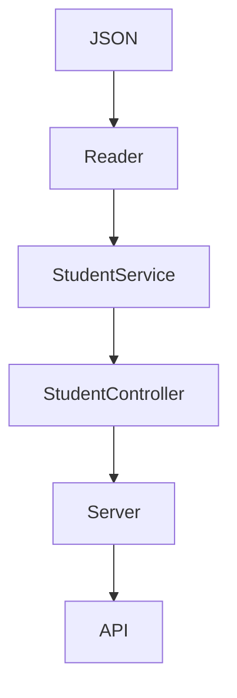
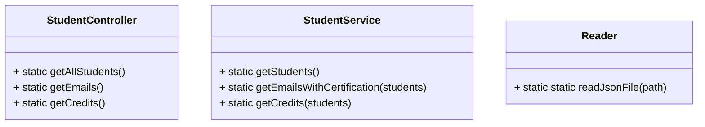

# 💥 Code Challenge 

Consulta [Code Challenge](https://github.com/LaunchX-InnovaccionVirtual/MissionNodeJS/blob/main/semanas/semana_4/5_code_challenge.md) para ver a detalle en que consiste el proyecto.

✔️ **Requerimientos del proyecto**

1. Habilitar un endpoint para consultar todos los estudiantes con todos sus campos.
2. Habilitar un endpoint para consultar los emails de todos los estudiantes que tengan certificación `haveCertification`.
3. Habilitar un endpoint para consultar todos los estudiantes que tengan `credits` mayor a 500.

## Dependencias usadas 

🎯 **Node.js**

Proyecto creado en Node.js versión 16.14.2.

Creación del proyecto con el comando `npm init` para generar el archivo *package.json*.

Puedes consultar: <https://nodejs.org/es/download/>

🎯 **Jest - Pruebas unitarias**

El proyecto cuenta con una carpeta llamada `test`, en la cual se encuentran scripts referentes a pruebas unitarias para comprobar el funcionamiento del código. 

Para ejecutar las pruebas se instaló `jest` versión 26.0.0.

Comando para la instalación de la dependencia jest: 
+ `npm install jest@26.0.0 --save`
  
Configuración en el package.json para ejecutar los scripts de pruebas: 
+ `"test": "node ./node_modules/jest/bin/jest"`

Comando para ejecutar los scripts de pruebas una vez instalado jest: 
+ `npm test "ruta/dirección del script"`

Puedes consultar: <https://jestjs.io/docs/getting-started>

🎯 **GitHub Actions - Pruebas automatizadas**

Este proyecto maneja GitHub Actions para ejecutar pruebas automatizadas.

Dentro de la carpeta `.github`, se encuentra otra carpeta llamada `workflows` que contiene el archivo `test.yml`, el cual permite la automatización de las pruebas cada que se realiza un `git push` al repositorio remoto.

🎯 **Express - API**

Para la creación de la API, se instaló Express.

Comando para instalar Express:
+ `npm install express --save`

Configuración en el package.json para ejecutar el servidor:
+  `"server": "node ./lib/server.js"`

Comando para ejecutar el servidor automatizado:
+ `npm run server`

Puedes consultar: <https://expressjs.com/es/starter/installing.html>

🎯 **ESLint**

Permite revisar la sintaxis del código y darle estilo mediante reglas automatizadas.

Comando para instalar Linter:
+ `npm install eslint --save-dev`

Comando para configurar Linter:
+ `npm init @eslint/config`
  
Comando para buscar las inconsistencias de escritura:
+ `npm run linter`

Comando para arreglar todos los errores detectados:
+ `npm run linter-fix`

Configuración en el package.json para ejecutar Linter:
+  `"linter": "node ./node_modules/eslint/bin/eslint.js"`
+  `"linter-fix": "node ./node_modules/eslint/bin/eslint.js . --fix"`

Consulta [.eslintrc.js](https://github.com/DanielaBeltranCruz/Code-Challenge/blob/master/.eslintrc.js) para ver las reglas usadas en el proyecto. 

Puedes consultar: <https://eslint.org/docs/user-guide/getting-started>

## Diseño del proyecto

El proyecto esta estructurado de la siguiente manera:
+ .github/workflows - Esta carpeta contiene un archivo `.yml`que permite el manejo de pruebas automatizadas usando GitHub Actions.
+ lib - Dentro de esta carpeta se encuentran tres carpetas más que contienen los scripts necesarios para dar funcionalidad a cada endpoint requerido.
+ test - Esta carpeta contiene los archivos de pruebas de cada script de la carpeta anterior.
+ .eslintrc.js - Este archivo contiene las reglas a seguir para corregir la sintaxis.
+ .gitignore - Este archivo permite ignorar la carpeta `node_modules` que se crea cuando se instala alguna dependencia y la cual no debe ser versionada. 
+ package-lock.json - Este archivo se crea y se va actualizando cada que se instala una dependencia nueva al proyecto.
+ package.json - Este archivo contiene la información referente a las dependencias instaladas así como también las configuraciones de las dependencias.
+ visualpartnerts.json - Este archivo contiene la base de datos a utilizar en formato JSON.

#### Diagrama de funcionalidad de la API

#### Diagramas del diseño de las clases y sus métodos correspondientes

## Explicación de la API

Para la construcción de la API de este proyecto, se maneja la carpeta `lib` que contiene las siguientes carpetas: `controllers`, `services` y `utils`; y un script llamado `server.js`.

+ Carpeta **`utils`** contiene un archivo llamado `Reader.js` el cual permite la lectura del archivo `visualpartners.json` para obtener datos.
+ Carpeta **`services`** contiene el archivo `StudentService.js` que permite exportar la clase `StudentService`, la cual contiene tres métodos que nos permiten obtener la información para los endpoints.
+ Carpeta **`controllers`** contiene el archivo `StudentController.js` que permite exportar la clase `StudentController`, la cual contiene tres métodos que permiten conectar a la clase del archivo `StudentService.js` para enviar esa información a la API cada que sea requerida, es decir, es el enlace para las consultas de los endpoints.
+ Archivo **`server.js`** permite conectar con el archivo `StudentController.js` cada vez que se haga una solicitud sobre alguna consulta. Para realizar las peticiones se utilizó el método GET de HTTP.

### 📍 ¿Cómo consultarla?

| Endpoint | Request | Response |
|---|---|---|
| `"/"` | `http://localhost:3000/` | Mensaje "Code Challenge Api, Welcome!" |
| `"/v1/students"` | `http://localhost:3000/v1/students` | Regresa todos los estudiantes |
| `"/v1/students/emails"` | `http://localhost:3000/v1/students/emails` | Regresa una lista con los emails de los estudiantes que tienen certificación |
| `"/v1/students/credits"` | `http://localhost:3000/v1/students/credits` | Regresa una lista de los estudiantes que tengan créditos mayor a 500 |

Para consultar los endpoints es necesario habilitar el servidor usando el comando `npm run server` en la consola de la terminal. Habiendo hecho lo anterior, se abre el navegador y se escribe la url <http://localhost:3000/>, esta ruta permitirá acceder a la información consultada de acuerdo a los endpoints.

Para deshabilitar el servidor, es necesario ubicarse en la consola de la terminal y presionar `ctrl + C`, después presionar `S` y dar enter.

### Ejemplos

1. Endpoint para consultar todos los estudiantes con todos sus campos.
   

2. Endpoint para consultar los emails de todos los estudiantes que tengan certificación `haveCertification`.

3. Endpoint para consultar todos los estudiantes que tengan `credits` mayor a 500.

